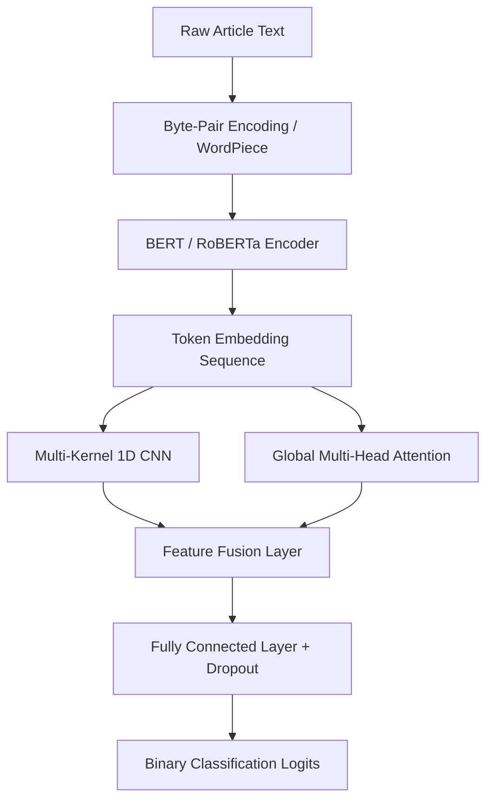

### Project Overview

The dissemination of misinformation across digital media platforms poses significant societal challenges. Automated fake news detection systems must identify subtle linguistic markers, semantic inconsistencies, and rhetorical patterns across diverse topics. This project implements an end-to-end deep learning framework that processes raw article text, extracts multi-scale semantic and contextual representations, and classifies articles as reliable or deceptive. The architecture integrates pre-trained Transformer embeddings with a 1D Convolutional Neural Network (CNN) feature extractor.

---

### Model Architecture & Attention Mechanism

The model leverages a hybrid architecture combining the contextual capabilities of bidirectional encoder representations with the localized pattern-extraction properties of convolution filters.

#### 1. Transformer Contextual Embeddings

Articles are tokenized and processed through a pre-trained Transformer model (e.g., RoBERTa) to generate high-dimensional token representations. The self-attention mechanism computes representations by analyzing the relationships between all words in a sequence, formulated as:

$$\text{Attention}(\mathbf{Q}, \mathbf{K}, \mathbf{V}) = \text{softmax}\left(\frac{\mathbf{Q} \mathbf{K}^T}{\sqrt{d_k}}\right) \mathbf{V}$$

where $\mathbf{Q}$, $\mathbf{K}$, and $\mathbf{V}$ represent the Query, Key, and Value matrices projected from the input embeddings, and $d_k$ is the dimensionality of the keys. Multi-head attention projects these matrices $h$ times to learn distinct contextual relationships:

$$\text{MultiHead}(\mathbf{Q}, \mathbf{K}, \mathbf{V}) = \text{Concat}(\text{head}_1, \dots, \text{head}_h)\mathbf{W}^O$$

$$\text{head}_i = \text{Attention}(\mathbf{Q}\mathbf{W}_i^Q, \mathbf{K}\mathbf{W}_i^K, \mathbf{V}\mathbf{W}_i^V)$$

#### 2. Multi-Scale 1D CNN Layer

To extract local n-gram structures and phrase-level patterns, the sequence of token embeddings is concurrently fed to a parallel 1D CNN layer. The layer contains three distinct kernel sizes ($k \in \{3, 4, 5\}$). For a window of embeddings $\mathbf{x}_{i:i+k-1}$, a feature $c_i$ is generated by:

$$c_i = f(\mathbf{w} \cdot \mathbf{x}_{i:i+k-1} + b)$$

where $\mathbf{w}$ is the filter weight vector, $b$ is a bias term, and $f$ is a non-linear activation function (ReLU). Max-over-time pooling is applied to capture the most salient features from each filter map.

---

### Training & Regularization

The network is optimized using AdamW (Adam with decoupled weight decay) to prevent overfitting during fine-tuning of the deep Transformer parameters.

#### 1. Objective Function

The objective is to minimize the binary cross-entropy loss augmented with L2 regularization over the linear classification parameters:

$$\mathcal{L}_{\text{total}} = -\frac{1}{N} \sum_{i=1}^{N} \left[ y_i \log(\hat{y}_i) + (1 - y_i) \log(1 - \hat{y}_i) \right] + \lambda \|\mathbf{W}\|^2_2$$

where $y_i$ is the actual label (1 for fake news, 0 for true news), $\hat{y}_i$ is the predicted probability, and $\lambda$ is the weight decay coefficient.

#### 2. Learning Rate Scheduler

To stabilize training, we implement a linear warmup scheduler. The learning rate increases linearly from 0 to $\eta_{\text{max}}$ during the first 10% of training steps, followed by a linear decay to 0:

$$
\eta(t) = \begin{cases}
\eta_{\text{max}} \cdot \frac{t}{T_{\text{warmup}}} & t < T_{\text{warmup}} \\
\eta_{\text{max}} \cdot \left(1 - \frac{t - T_{\text{warmup}}}{T_{\text{total}} - T_{\text{warmup}}}\right) & t \ge T_{\text{warmup}}
\end{cases}
$$

---

### Reference Material & PDF Download

For a detailed analysis of tokenization limitations, dataset bias, and validation testing on out-of-domain news datasets, you can download the full project report:

- [Online Fake News Detection Project Report](/assets/pdf/CS_7643___Final_Project.pdf)
