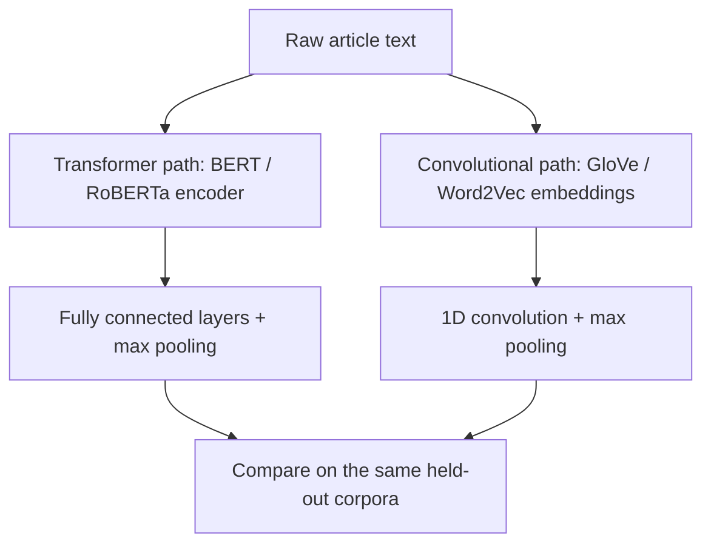

### Project Overview

Misinformation spreads through digital media at a scale manual fact-checking cannot match. The proposal opens with two figures from Kshetri and Voas (2017), both hedged there and worth keeping hedged here: one study suggested that 62 percent of US adults got news from social media, and estimates suggested that in the final three months of the 2016 US presidential campaign the top-performing fake election stories on Facebook drew more engagement than top stories from major outlets such as the New York Times. Automated detection has to pick up linguistic markers and rhetorical patterns that generalize across topics.

Team project for **CS7643 Deep Learning**, Georgia Tech, with Haochi Li, Marwa F. Qabeel, and Nicholas B. Pendley, under the team name "News Detectives".

> **Scope of this page.** The document linked at the bottom is the **project proposal**. It sets out the approach, the datasets, and the evaluation plan; it does not contain trained-model results. This page describes the proposed design and stops there rather than reporting numbers the source does not establish.

---

### Proposed Approach

The proposal names two model families to explore and compare rather than a single fixed architecture: sequence-to-sequence transformers, and convolutional networks over word embeddings.

```mermaid
graph TD
    Input[Raw article text] --> A[Transformer path: BERT / RoBERTa encoder]
    Input --> B[Convolutional path: GloVe / Word2Vec embeddings]
    A --> AF[Fully connected layers + max pooling]
    B --> BF[1D convolution + max pooling]
    AF --> Compare[Compare on the same held-out corpora]
    BF --> Compare
```

**Why compare these two.** They fail in different places, which is the point of running both. A transformer encoder's self-attention relates every token to every other token, so it can carry a claim made in the opening paragraph to a qualification twenty sentences later. What it does not privilege is local phrasing. Fabricated articles tend to carry short, position-independent tells (sensational bigrams, particular punctuation and casing patterns, formulaic attributions), and a 1D convolution with max pooling is the cheaper detector for exactly that, sliding a fixed window and keeping the strongest activation wherever it occurs.

The comparison measures something specific: how much of the achievable signal is stylistic rather than semantic. The associated risk is equally specific. Local phrasing tells are the features most tied to a particular publication era and a particular set of outlets, so a model leaning on them scores well in-distribution and degrades on sources it has not seen, which is why the out-of-domain corpus matters more here than the headline metric.

One practical constraint bounds the transformer path and the proposal does not address it: BERT and RoBERTa cap input at 512 tokens, which is shorter than many full news articles, so the long-range context argument holds only within that window unless articles are chunked or truncated.

**Fine-tuning.** The pre-trained encoders are extended with fully connected layers and max pooling, optimized with **Adam** against a **cross-entropy** objective.

**Feature extraction comparison.** Alongside the learned embeddings, the proposal sets out to compare TF-IDF and classical word embeddings, to establish how much of the signal lives in the article title alone.

**Evaluation.** Accuracy, precision, recall, and F1, followed by an error analysis over misclassified instances to characterize what makes a fabricated article hard to detect.

---

### Datasets

Three corpora were identified, the third chosen to test whether a model trained on one news domain survives contact with another:

| Dataset                                  | Role                            |
| :--------------------------------------- | :------------------------------ |
| Kaggle _Fake and real news_              | Primary training and evaluation |
| _News Articles_ dataset                  | Secondary organized corpus      |
| Kaggle _Fake News around the Syrian War_ | Out-of-domain validation        |

The primary corpus carries titles, authors, countries, and images, with labels including "BS", "bias", "fake", and "conspiracy".

---

### Related Work

The methods this project builds on, and the gap each leaves:

- **N-gram analysis with TF-IDF and a linear SVM** reaches 92 percent accuracy, setting the classical baseline a deep model has to beat.
- **Hybrid CNN-RNN architectures** validated on the ISOT and FA-KES datasets outperform non-hybrid baselines, and are the direct precedent for pairing convolution with a sequence model here.
- **Bidirectional LSTM with pre-trained word embeddings**, using back-translation to address class imbalance, outperforms plain CNN and ResNet across datasets.
- **Multimodal consistency methods** fusing text and image features, and **language-independent filtering** applied to Twitter data during the Hong Kong protests, both point at signal outside the article body that a text-only model gives up.

---

### Reference Material

- [Online Fake News Detection: Project Proposal (PDF)](/assets/pdf/CS_7643___Final_Project.pdf): problem framing, approach, datasets, and the related-work survey.
