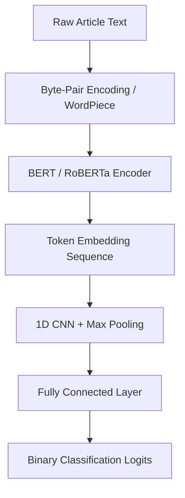

### Project Overview

Misinformation spreads through digital media at a scale manual fact-checking cannot match. Roughly 62 percent of US adults get news from social media, and in the final three months of the 2016 US presidential campaign the top-performing fake election stories on Facebook attracted more views than the top stories from the New York Times, Washington Post, Huffington Post, or NBC News. Automated detection has to pick up subtle linguistic markers and rhetorical patterns that generalize across topics.

Team project for **CS7643 Deep Learning**, Georgia Tech, with Haochi Li, Marwa F. Qabeel, and Nicholas B. Pendley, under the team name "News Detectives".

> **Scope of this page.** The document linked at the bottom is the **project proposal**. It sets out the approach, the datasets, and the evaluation plan; it does not contain trained-model results. This page describes the proposed design and stops there rather than reporting numbers the source does not establish.

---

### Proposed Approach

The plan was to combine the contextual strength of pre-trained transformers with the localized pattern extraction of convolutional networks, then measure that hybrid against the transformer alone.

```mermaid
graph TD
    Input[Raw Article Text] --> Tokenizer[Byte-Pair Encoding / WordPiece]
    Tokenizer --> Transformer[BERT / RoBERTa Encoder]
    Transformer --> Embeddings[Token Embedding Sequence]
    Embeddings --> CNN[1D CNN + Max Pooling]
    CNN --> Dense[Fully Connected Layer]
    Dense --> Output[Binary Classification Logits]
```

**Contextual embeddings.** Articles are tokenized and passed through a pre-trained BERT or RoBERTa encoder. Self-attention relates every token to every other token in the sequence:

$$\text{Attention}(\mathbf{Q}, \mathbf{K}, \mathbf{V}) = \text{softmax}\left(\frac{\mathbf{Q} \mathbf{K}^T}{\sqrt{d_k}}\right) \mathbf{V}$$

where $\mathbf{Q}$, $\mathbf{K}$, and $\mathbf{V}$ are the query, key, and value projections of the input embeddings and $d_k$ is the key dimensionality. Multi-head attention repeats this projection $h$ times to learn distinct relationships:

$$\text{MultiHead}(\mathbf{Q}, \mathbf{K}, \mathbf{V}) = \text{Concat}(\text{head}_1, \dots, \text{head}_h)\mathbf{W}^O$$

**Fine-tuning.** The pre-trained encoders are extended with fully connected layers and max pooling, optimized with **Adam** against a **cross-entropy** objective.

**Feature extraction comparison.** Alongside the learned embeddings, the proposal sets out to compare TF-IDF and classical word embeddings, to establish how much of the signal lives in the article title alone.

**Evaluation.** Accuracy, precision, recall, and F1, followed by an error analysis over misclassified instances to characterize what makes a fabricated article hard to detect.

---

### Datasets

Three corpora were identified, the third specifically to test whether a model trained on one news domain survives contact with another:

| Dataset                                  | Role                            |
| :--------------------------------------- | :------------------------------ |
| Kaggle _Fake and real news_              | Primary training and evaluation |
| _News Articles_ dataset                  | Secondary organized corpus      |
| Kaggle _Fake News around the Syrian War_ | Out-of-domain validation        |

The primary corpus carries titles, authors, countries, and images, with labels including "BS", "bias", "fake", and "conspiracy".

---

### Related Work

The methods this project builds on, and the gap each leaves:

- **N-gram analysis with TF-IDF and a linear SVM** reaches 92 percent accuracy, setting the classical baseline a deep model has to beat.
- **Hybrid CNN-RNN architectures** validated on the ISO and FA-KES datasets outperform non-hybrid baselines, and are the direct precedent for pairing convolution with a sequence model here.
- **Bidirectional LSTM with pre-trained word embeddings**, using back-translation to address class imbalance, outperforms plain CNN and ResNet across datasets.
- **Multimodal consistency methods** fusing text and image features, and **language-independent filtering** applied to Twitter data during the Hong Kong protests, both point at signal outside the article body that a text-only model gives up.

---

### Reference Material

- [Online Fake News Detection: Project Proposal (PDF)](/assets/pdf/CS_7643___Final_Project.pdf): problem framing, approach, datasets, and the related-work survey.

---

### Related writing

- [Online Fake News Detection using Convolutional Neural Networks and Transformers]({{ '/blog/2024/online-fake-news-detection/' | relative_url }})
