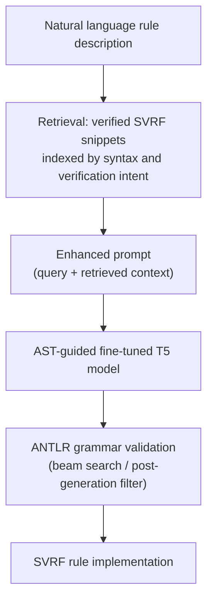

### Project Overview

Physical verification rule decks for semiconductor layouts are written in proprietary Domain-Specific Languages (DSLs), most notably Siemens SVRF (Standard Verification Rule Format). These rule decks specify the geometric, topological, and electrical constraints a design must satisfy to be manufacturable, and writing them requires both process understanding and command of a language whose documentation is not public. This combination produces a narrow expertise pool: SVRF rule decks are written by a limited set of specialized engineers, and the training required spans years.

I led this work as first author at Siemens EDA, with Mohamed A. Elsayed, Ilhami Torunoglu, and David Abercrombie. Every figure below is taken from the ICLAD 2025 paper cited at the bottom. Where I read the evidence differently from the paper's own wording, I say so rather than smoothing it over.

> **Scope note.** The dataset, the internal tooling, and the generated code are tied to proprietary Siemens material and are not publicly released, as stated in the paper. This page reports the published benchmark results and omits internal deployment metrics.

---

### The Data Problem

Applying a general pre-trained LLM to SVRF produces high hallucination rates and syntactically invalid output. This limitation stems from the semiconductor industry's constrained nature and the scarcity of public information about development methodologies, which leaves a proprietary language like SVRF thinly represented in any general training corpus.

Our experimental dataset was derived from an internal Design Rule Checking (DRC) knowledge base of 400 curated pairs, each pairing a natural language description of a design rule with its SVRF implementation. To make supervised fine-tuning viable at that scale, we expanded the set to 741 examples through LLM-based augmentation that preserved semantic validity, with domain experts verifying the generated examples. The final set was split 80-10-10 into 593 training, 74 validation, and 74 test examples, and spans three complexity tiers: simple rules (32.5%), moderate rules (46.8%), and complex rules (20.7%) involving nested operations, multiple layer dependencies, and advanced option combinations.

A representative pair looks like this:

- **Input (natural language)**: "Minimum spacing between METAL1 and METAL2 layers should not be less than 0.5um"
- **Output (SVRF)**: `SPACE_CMD METAL1 METAL2 >= 0.5 READ ALL { REPORT "Spacing violation detected" }`

---

### AST-Guided Fine-Tuning

The central design decision was to stop treating SVRF as a token sequence and start treating it as a structure. We defined SVRF's core components (such as `COMMAND` and `LAYERS`) as an ANTLR grammar, which gives a deterministic parse of any candidate the model produces.

#### 1. Serialization for LLM consumption

Raw ANTLR parse trees are too verbose to feed a language model directly. These trees are preprocessed in two steps: the parse tree is streamlined into a more abstract AST by removing redundancies and standardizing node types, and that AST is then serialized into a linearized bracketed string via depth-first traversal, preserving hierarchy for LLM tokenization:

```
(COMMAND (OPTION val) ...)
```

#### 2. AST-weighted loss

During fine-tuning, both the candidate and the ground-truth SVRF are parsed into ASTs, and the loss function compares the two structures rather than their surface tokens. Discrepancies are penalized according to their significance, so an error in a command or a layer reference costs more than an error in a minor option. This structural feedback lets the model learn syntactic and semantic rules more effectively than a standard cross-entropy loss over tokens.

#### 3. Grammar validation at inference

Correctness is enforced again at generation time through lightweight ANTLR parsing, applied during beam search or as a post-generation filter, so malformed snippets are penalized or discarded rather than returned.

---

### Retrieval-Augmented Generation

Structural guidance constrains the shape of the output but does not supply domain knowledge about which rule to write. To provide that, we built a RAG workflow over a curated database of verified SVRF snippets indexed not only by their syntactic characteristics but also by their associated physical verification intents. The retrieval process is further enhanced by a knowledge graph that captures relationships between semiconductor processes and their corresponding SVRF implementations, enabling the system to rank candidate patterns on both syntactic similarity and semantic relevance.



---

### Model Selection

We selected the T5 architecture family for its encoder-decoder structure, which offers bidirectional context understanding in the encoder for capturing design rule relationships and a structured decoding process that better maintains syntactic consistency than an autoregressive decoder-only model. Three variants were evaluated:

| Model        | Parameters |
| :----------- | :--------- |
| T5-base      | 220M       |
| Flan-T5-base | 250M       |
| CodeT5-base  | 220M       |

We maintained the models' original tokenizers without custom modifications, demonstrating that standard pre-trained vocabularies adapt to SVRF syntax. The paper also names Claude Sonnet 3.5, prompted directly with basic SVRF documentation in its context window, as a large-model baseline, though it reports no results for that baseline and no comparison against it should be inferred.

This combination is the part of the result I would defend hardest: a 220M-parameter model, 741 examples, 8 hours of training, and an unmodified vocabulary. The claim that carries is about method transferability rather than budget. If a proprietary DSL with no public corpus can be reached at this scale by encoding its grammar into the loss, the approach ports to other internal languages that will never justify a large pre-training run.

---

### Evaluation Metrics

BLEU and ROUGE-L are n-gram based and may not capture the structural and semantic correctness that matters for a language like SVRF. Command ordering in SVRF is non-sequential, layer sequence carries meaning, and commands nest hierarchically, so two implementations with high lexical overlap can differ in whether they are correct. To address this, we proposed an **AST-Weighted Accuracy** metric that dissects the generated code into its core structural components and evaluates their correctness with differential importance, reported alongside Loss, BLEU, and ROUGE-L.

---

### Results

All three models score **0% AST-weighted accuracy zero-shot**, which the paper reads as limited transfer of pre-trained capabilities to SVRF generation. Their zero-shot BLEU and ROUGE-L are not zero (0.085 and 0.296 for T5-base), so the accuracy figure is better understood as output that fails to parse than as an absence of transfer. The table below reports test-set performance after fine-tuning, with and without AST guidance:

| Model        | AST guidance | AST-weighted accuracy | BLEU  | ROUGE-L |
| :----------- | :----------- | :-------------------- | :---- | :------ |
| T5-base      | without      | 50.289%               | 0.702 | 0.780   |
| T5-base      | with         | **56.042%**           | 0.796 | 0.865   |
| Flan-T5-base | without      | 46.407%               | 0.695 | 0.777   |
| Flan-T5-base | with         | **58.947%**           | 0.837 | 0.885   |
| CodeT5-base  | without      | 57.211%               | 0.763 | 0.828   |
| CodeT5-base  | with         | **62.879%**           | 0.840 | 0.898   |

Training ran for 20 epochs, taking 6 hours without AST guidance and 8 hours with it.

These are single-run figures on a 74-example test set, reported without seed variance or confidence intervals. The T5-base gap of 5.75 points rests on roughly four test examples, and no individual difference in this table should be treated as separated by more than the noise a rerun would produce.

The consistency is the part that survives that objection. AST guidance improves every one of the three architectures on every one of the three metrics: nine comparisons, all in the same direction, across models with independent pre-training. Treating each comparison as a coin flip under the null that AST guidance does nothing puts the probability of nine same-signed outcomes at $2^{-9} pprox 0.002$. That argument does not depend on any single delta clearing the noise floor, which is exactly why it is the one worth making.

**Where the headline number comes from.** The paper's reported improvement of approximately 40% is the _relative_ gain in validation AST-weighted accuracy for Flan-T5-base (37.271% to 51.519%) from AST-guided fine-tuning versus standard text-based fine-tuning, with a corresponding 27% relative gain on the test set. The ratio of those two validation figures is 1.382, an increase of 38.2%, which the paper reports exactly in its appendix and rounds to approximately 40% in the abstract. It is a model-accuracy result on a held-out benchmark, and it should not be read as a measured reduction in engineering time.

One further discrepancy is worth naming, since a careful reader will find it: the paper's abstract describes a benchmark of 740 rule implementations, while its body, its dataset table, and its 593/74/74 split all give 741. The larger figure is the one the experiments actually used.

**Generalization is the more interesting result.** CodeT5 without AST guidance drops from 86.729% training accuracy to 57.211% at test, a gap of 29.518 percentage points. With AST guidance the same model drops from 86.003% to 62.879%, a gap of 23.124 points, and the validation-to-test gap narrows to 0.917 points.

The paper reads this as structural regularization. It is worth being precise about what the numbers alone support: training accuracy is essentially unchanged between the two CodeT5 rows (86.729% against 86.003%), so the gap closes from the test side rather than by constraining the fit, and Flan-T5's training accuracy actually rises under AST guidance (84.937% to 86.808%). A regularizer would be expected to reduce training fit. "AST guidance produces a better model" fits this evidence at least as well as "AST guidance regularizes", and separating the two would need a capacity or noise sweep that the paper does not run.

---

### Limitations

Peak accuracy of 62.879% on the test set indicates substantial room for improvement, and the paper states this plainly. Three factors bound the current result: code generation requires understanding operation relationships, precedence, and scope beyond structural correctness; the 741-example dataset, even after augmentation, may not fully capture the diversity of possible SVRF structures; and AST guidance enforces syntax without semantic validation such as type checking, scope analysis, or operation compatibility verification.

Among the directions the paper identifies, the one I would pursue first is making the AST-weighted metric differentiable so that structural correctness enters the training objective directly, rather than serving only as an evaluation criterion.

---

### Editor Integration

The methodology was extended into the development environment to deliver a copilot-like experience. The system analyzes the current code context and active coding patterns, retrieves relevant patterns and examples from the indexed repository, and combines that retrieved knowledge with the immediate editing context to generate suggestions in real time. This dual-context design lets suggestions reflect both the specific task and broader workspace conventions.

---

### Reference Publication

If you find this work useful, please cite our corresponding publication:

<div class="publications">

</div>
