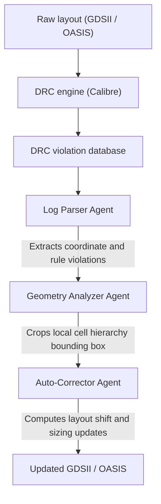

### Project Overview

Semiconductor physical verification, comprising Design Rule Checking (DRC) and Layout vs. Schematic (LVS), is the final gatekeeping step before tape-out. At advanced nodes ($7\text{ nm}$ and below), the Process Design Kit (PDK) verification deck contains tens of thousands of complex geometric and electrical rules. Designing layouts that comply with these rules requires a highly repetitive cycle of running verification, analyzing massive error logs, and manually correcting polygon coordinates in GDSII/OASIS layout files.

This project developed an intelligent agentic framework that compiles rule decks, executes verification runs (e.g., using Siemens Calibre), parses violation logs, and executes closed-loop geometric modifications to automatically correct layout DRC violations.

---

### PDK Verification & Constraint Compilation

Verification decks are written in languages like SVRF or TVF (Tcl Verification Format). The deck compiles into an execution tree of layer operations.

#### 1. Layer Definitions and Derived Layers

Layout files store raw layers (e.g. active area, poly-silicon gate, metal routing). The compiler first derives functional layers using Boolean operations:

$$\text{Gate} = \text{Poly} \cap \text{Active}$$

This gate layer is then used to verify channel length, channel width, and source/drain spacings.

#### 2. DRC Violation Database (DFDB)

When verification runs, the DRC engine writes violations to a Database. The database stores the violating rule name, cell name, and coordinates of the polygon vertices causing the error. Our tool parses this data to build a spatial index of errors.

---

### Geometric Layout Verification Operations

DRC rules are defined as topological and spatial relations between layout polygons. Our engine models these checks as set-theoretic and distance queries on 2D planar geometries.

#### 1. Minimum Spacing Verification

A minimum spacing rule between metal polygons on a layer $A$ specifies that no two edge segments can lie within a distance $d_{\text{min}}$ of each other:

$$\text{Spacing}(A) = \left\{ (p_1, p_2) \in \partial P_i \times \partial P_j,\; i \neq j \mid \|p_1 - p_2\|_2 < d_{\text{min}} \right\}$$

where $P_i$ and $P_j$ are distinct polygons on layer $A$ and $\|\cdot\|_2$ is the Euclidean norm. If $\text{Spacing}(A) \neq \emptyset$, the coordinates are flagged as a violation.

The distinct-polygon condition is what makes the definition usable. Quantifying over $\partial A \times \partial A$ without it admits adjacent points on the same boundary curve, whose separation tends to zero, so the set would be non-empty for every layout ever checked.

#### 2. Enclosure and Extension Verification

For overlapping layers (e.g., contact vias $A$ and metal routes $B$), the metal layer must enclose the via by a minimum extension distance $e_{\text{min}}$:

$$\text{Enclosure}(A, B) = \left\{ p \in \partial A \mid p \notin B \;\text{ or }\; \min_{q \in \partial B} \|p - q\|_2 < e_{\text{min}} \right\}$$

Our engine compiles these constraints into a computational DAG (Directed Acyclic Graph) of Boolean operations (AND, OR, NOT, XOR), sizing (dilation/erosion), and distance searches.

---

### Hierarchical Layout Processing & Cell Trees

To handle modern layout files containing billions of transistors, flat processing is infeasible. The engine processes layouts hierarchically using a cell dependency graph:

$$H = (C, E)$$

where:

- $C$ represents the set of cells (sub-circuits and standard cells).
- $E$ represents instantiation edges representing parent-child relationships in the layout tree.

By traversing $H$ in reverse topological order (bottom-up), our engine corrects violations inside leaf cells first (e.g., standard cells), so corrections propagate to all parent instances without duplicate calculations.

---

### Collaborative Multi-Agent Layout Repair Flow

The automated verification and repair system is orchestrated as a collaborative multi-agent workflow:

1. **Log Parser Agent**: Ingests massive ascii/binary DRC summary reports, extracts error codes, cell references, and coordinate polygons, and builds a spatial index using an R-tree.
2. **Geometry Analyzer Agent**: Identifies the local cell coordinate boundaries and extracts the local polygon mesh surrounding the violation. It crops the layout to isolate the problem region.
3. **Auto-Corrector Agent**: Formulates a localized constrained optimization problem to resolve spacing or width violations by adjusting polygon vertex positions:

   $$\min_{\Delta \mathbf{x}, \Delta \mathbf{y}} \sum_{i} \left( \Delta x_i^2 + \Delta y_i^2 \right)$$

   subject to:
   - Spacing constraints: $x_{i, \text{right}} - x_{j, \text{left}} \ge d_{\text{min}}$ (for horizontal spacing errors).

---

### What the System Does, and What It Deliberately Does Not

> **Scope note.** This work was built and deployed inside Siemens EDA. Repair rates, coverage figures, and cycle times were measured against customer rule decks that I cannot publish, so no numbers are reported here.

The system automatically repairs the classes of post-routing DRC violation that have a deterministic geometric fix: width, spacing, and enclosure errors within a sub-block. The design constraint that shaped everything else is that an automatic layout edit is only acceptable if it cannot silently break the circuit, so every proposed repair is gated on two checks before it is applied:

- **Geometric closure**: re-running the affected rule set on the modified region to confirm the repair did not introduce a new violation elsewhere, since spacing fixes routinely create width violations one layer over.
- **Electrical connectivity preservation**: comparing the modified layout graph against the schematic network (LVS validation) to confirm no new shorts or opens were created.

Violations that do not have a unique geometric fix are escalated rather than guessed at. This is the boundary that makes the tool usable: a repair engine that resolves a high fraction of violations but occasionally alters connectivity is worse than useless, because it moves the engineer's work from fixing layout to auditing the tool.

Verification runs distribute across heterogeneous compute clusters. Parallelism here buys throughput, not coverage: coverage is a property of the rule deck and the pattern set, and no amount of parallel execution changes it.
