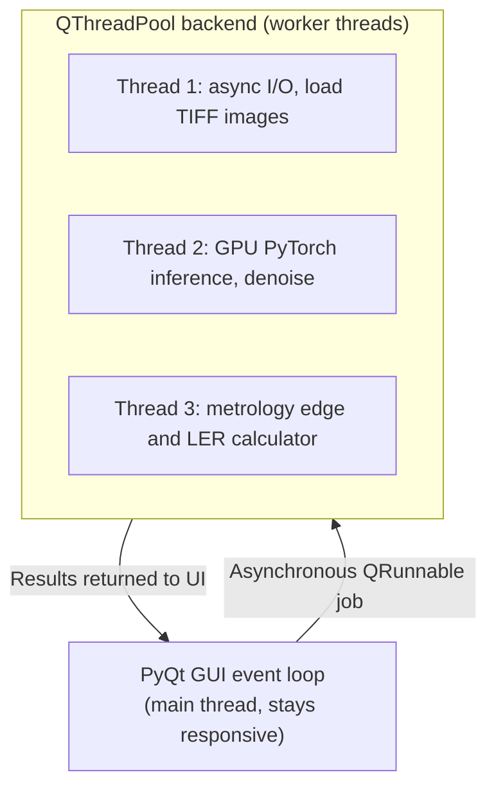

### Project Overview

In semiconductor manufacturing, Critical Dimension Scanning Electron Microscopes (CD-SEMs) are the standard instruments for measuring nano-scale features on silicon wafers. However, raw CD-SEM scans are highly noisy due to charging effects, shot noise from low-dose electron beams (required to prevent resist damage), and physical scanner vibrations. This noise corrupts edge detection, leading to errors in the calibration of Optical Proximity Correction (OPC) models.

This project built a deep-learning-based image cleaning and metrology extraction pipeline. The system filters out unusable images, denoises raw SEM scans, and extracts critical edge dimensions, supported by a custom multi-threaded desktop GUI for data auditing.

---

### Image Noise Modeling in CD-SEM

To clean SEM images, we must model the underlying physical noise processes.

#### 1. Poisson Noise (Shot Noise)

The primary source of high-frequency noise is the statistical variation in the number of secondary electrons detected per pixel. Since the electron dose is minimized to prevent resist shrinkage, the pixel intensities follow a Poisson distribution:

$$P(k \text{ electrons} \mid \lambda) = \frac{\lambda^k e^{-\lambda}}{k!}$$

where $\lambda$ represents the true structural intensity.

#### 2. Charging Effects

As the electron beam scans the wafer, negative charges accumulate on insulated photoresist features, deflecting incoming electrons. This produces slow-frequency intensity drifts and shadow artifacts, which we model as an additive spatial drift term:

$$I_{\text{noisy}}(x, y) = \text{Poisson}\left(I_{\text{clean}}(x, y)\right) + \eta_{\text{charge}}(x, y)$$

---

### Denoising Autoencoder Architecture

The image enhancement system uses a modified U-Net autoencoder with residual skip connections to remove noise while preserving structural edges.

#### 1. Residual Convolutional Blocks

Each layer block in the encoder and decoder contains two $3 \times 3$ convolutional layers followed by Batch Normalization and a LeakyReLU activation. Residual connections bypass the blocks:

$$\mathbf{x}_{l+1} = \text{LeakyReLU}\left( \text{BN}\left( \text{Conv}(\mathbf{x}_l) \right) \right) + \mathbf{x}_l$$

This prevents gradient degradation in deep architectures, preserving sub-nanometer line-edge details.

#### 2. Composite Loss Function

The network is trained using a composite loss function combining Mean Squared Error (MSE) and Structural Similarity Index Measure (SSIM) to preserve sharp boundary gradients:

$$\mathcal{L}_{\text{total}} = (1 - \gamma)\mathcal{L}_{\text{MSE}} + \gamma \left( 1 - \text{SSIM}\left(I_{\text{clean}}, \hat{I}_{\text{clean}}\right) \right)$$

where $\gamma = 0.4$ controls the structural reconstruction weight, and $\text{SSIM}$ evaluates luminance, contrast, and structural similarity over local $11 \times 11$ pixel patches.

---

### Metrology & Contour Fitting Optimization

Once the image is denoised, our engine extracts the boundary coordinates of the resist patterns.

#### 1. Active Contour Fitting (Snakes)

We initialize a parametric contour curve $\mathbf{v}(s) = (x(s), y(s))$ near the denoised edge and minimize its energy functional:

$$E_{\text{snake}} = \int_{0}^{1} \left( E_{\text{internal}}(\mathbf{v}(s)) + E_{\text{external}}(\mathbf{v}(s)) \right) ds$$

where $E_{\text{internal}}$ maintains curve smoothness and $E_{\text{external}} = -\beta \|\nabla \hat{I}_{\text{clean}}(\mathbf{v}(s))\|^2$ pulls the contour toward the steepest image gradients.

#### 2. LER and LWR Formulation

- **Line-Edge Roughness (LER)** is calculated as the $3\sigma$ standard deviation of the edge coordinates $x_i$ from a fitted straight line $\bar{x}$:

  $$\text{LER} = 3 \sqrt{\frac{1}{N} \sum_{i=1}^{N} \left( x_i - \bar{x} \right)^2}$$

- **Line-Width Roughness (LWR)** tracks the variation in local linewidth $w_i$ (distance between left and right contours):

  $$\text{LWR} = 3 \sqrt{\frac{1}{N} \sum_{i=1}^{N} \left( w_i - \bar{w} \right)^2}$$

---

### Multi-Threaded PyQt Visualization Dashboard

I designed and delivered this tool at Siemens EDA. To let calibration engineers audit the network's predictions, I built a cross-platform desktop application using Python, PyQt5, and PySide.

- **Asynchronous QThread Execution**: By dispatching disk I/O and GPU neural network inference to a managed `QThreadPool`, the user interface stays responsive while inference runs, even when processing gigabytes of raw TIFF files. No frame-rate figure is reported here.
- **Interactive Annotation**: Integrated interactive canvas tools using `QGraphicsView`, enabling users to adjust metrology search boxes and inspect individual sub-pixel edge points overlaid on the denoised image.

---

### Outcomes

Because this ran inside Siemens EDA against customer SEM data, the measurement-variance and workflow figures stay internal. The result that mattered operationally was not precision on images that already worked. It was extraction on images that previously did not: low-contrast, thin-resist nodes that classical edge-detection tools rejected as unmeasurable. Those rejected images are not a uniform sample of the wafer, so discarding them biases the OPC model that the metrology feeds, and recovering them changes the calibration rather than merely improving its error bar.

The precision evaluation compared CD measurement variance against classical Gaussian and median filtering on the same scans, broken out per node and per resist stack rather than pooled, since the denoiser's benefit is concentrated exactly where the classical filters degrade. Those results were measured internally and are the figures withheld above, rather than work that was never done.
