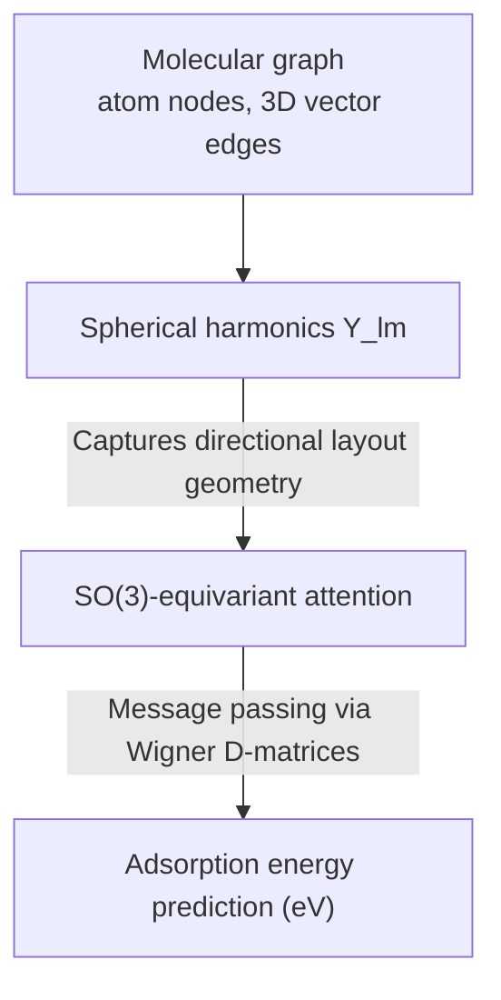

### Project Overview

Discovering novel catalyst materials for chemical synthesis, hydrogen production, and carbon capture requires searching through an astronomical space of alloy configurations and molecular adsorbates. While Density Functional Theory (DFT) provides a quantum-mechanical method to compute adsorption energies, solving these systems scales cubically ($O(N^3)$) with the number of electrons, limiting high-throughput discovery workflows.

This Vertically Integrated Project (VIP) at the Georgia Institute of Technology, supervised by Prof. Andrew J. Medford, utilized high-throughput DFT simulation pipelines and equivariant Graph Neural Networks (GNNs) to create fast, physically-consistent surrogate models for predicting material adsorption properties.

---

### High-Throughput Quantum Espresso Pipelines

To generate dataset samples, we built automated pipelines to execute DFT calculations on high-performance computing (HPC) clusters.

#### 1. Input Deck Generation and Job Automation

We wrote Python wrappers to construct Quantum Espresso input decks. The pipeline:

- Parses molecular structures from ASE (Atomic Simulation Environment) databases.
- Automates boundary cell setups and K-point grids (typically $4 \times 4 \times 1$ for surfaces).
- Generates Slurm batch scripts to distribute calculations across compute nodes.

#### 2. Plane-Wave Cutoff Validation

Calculations utilized Vanderbilt ultrasoft pseudopotentials, with the wavefunction and charge-density cutoffs fixed by convergence testing rather than assumed. The achieved convergence threshold is itself a measured quantity, so like the model results below it is not quoted here without a citable source.

---

### Kohn-Sham Physics Formulation

We executed first-principles quantum simulations to establish ground-truth relaxed atomic geometries and adsorption energies.

#### 1. Choosing the Exchange-Correlation Functional

The Kohn-Sham construction replaces the interacting multi-electron problem with a set of single-particle equations, and everything that is not exactly known is pushed into one term: the exchange-correlation potential. Choosing that term is the only real decision in the DFT half of this pipeline, and it fixes an accuracy ceiling for everything downstream.

We used the Generalized Gradient Approximation (GGA-PBE). The tradeoff is explicit: PBE is cheap enough to relax thousands of adsorbate-catalyst configurations, which is what makes a training set possible at all, but it carries a known systematic error on adsorption energies relative to experiment. That error is not noise the model can average away. It is baked into every label, so a surrogate trained on PBE data can at best reproduce PBE, and a reported error against a PBE-derived test set says little about absolute agreement with a real catalyst surface. The saving grace is that the error is systematic and partially cancels in relative and reaction energies, which is why PBE-based screening still ranks candidates usefully even where its absolute numbers are off.

This is the point worth carrying: a machine learning model inherits its labels' bias to the extent that it fits them, and no quantity of additional data drawn from the same functional removes it. Reducing it means either a higher level of theory or an explicit uncertainty estimate across functionals.

#### 2. Energy Minimization

The electron density is calculated iteratively until the system energy converges. The final adsorption energy $E_{\text{ads}}$ is:

$$E_{\text{ads}} = E_{\text{slab+adsorbate}} - \left( E_{\text{slab}} + E_{\text{adsorbate}} \right)$$

---

### Equivariant Graph Neural Network (Equiformer_v2)

To bypass expensive DFT relaxation runs, the adsorbate-catalyst system is represented as a 3D molecular graph $G = (V, E)$. To ensure physical consistency, the surrogate network must be equivariant to 3D rotations and translations (the Euclidean group $E(3)$).

- **Wigner Tensor Kernels**: We implemented **Equiformer_v2**, which leverages spherical harmonics $Y_{lm}(\mathbf{\hat{r}}_{ij})$ to represent relative atomic orientations. The message-passing updates node features $h_i$ using irreducible representations (irreps) of the $SO(3)$ rotation group:

$$h_i^{(l+1)} = h_i^{(l)} + \sum_{j \in \mathcal{N}(i)} \text{EquivAttn}\left(h_i^{(l)}, h_j^{(l)}, Y_{lm}(\mathbf{\hat{r}}_{ij})\right)$$

- **Irreps Mapping**: Features are decomposed into scalar (tensor type-0, $l=0$) and vector/tensor components ($l > 0$), allowing the network to track both coordinate-independent quantities (energies) and coordinate-dependent quantities (atomic forces) simultaneously.

---

### Force and Energy Gradient Training

Training only on target energies leads to physical instability during structure relaxation. To address this, we optimized the network to predict atomic forces, which are the negative gradients of the total energy with respect to atomic coordinates:

$$\mathbf{F}_i = -\nabla_{\mathbf{R}_i} E(\mathbf{R}_1, \dots, \mathbf{R}_N)$$

By applying backpropagation through the GNN to calculate the analytical gradient of the predicted energy, we trained the model using a joint loss function:

$$\mathcal{L} = \mathcal{L}_{\text{energy}} + \lambda_{\text{force}} \frac{1}{3N}\sum_{i=1}^{N} \|\mathbf{F}_{i,\text{pred}} - \mathbf{F}_{i,\text{dft}}\|^2$$

where $\lambda_{\text{force}} = 10.0$ balances energy and force training.

---

### Scope and Outcomes

> **Scope note.** No accuracy or speedup figures are reported here. This was Vertically Integrated Project work supervised by Prof. Andrew J. Medford, and I do not have a report I can cite for the model results. Publishing an unsourced error metric under a supervisor's name is worse than publishing none.

What the project produced was the data pipeline: a local database of relaxed adsorbate-catalyst configurations, constructed and managed following the Open Catalyst Project (OC20) specifications so that the representation would be compatible with pretrained checkpoints.

Two points about how a result here should be read, which matter more than any single error metric:

- **Dataset scale bounds the claim.** OC20-scale accuracy comes from on the order of a million relaxations. A local database of thousands supports fine-tuning or evaluating a pretrained checkpoint; it does not support a from-scratch model competitive with published benchmarks, and any MAE quoted without saying which of those two was done is uninterpretable.
- **A speedup against DFT is a category comparison, not a benchmark.** Inference is orders of magnitude faster than a relaxation by construction. The number that carries information is the accuracy retained at that speed, on a held-out set drawn from a different distribution than the training set, since screening is only useful when it extrapolates.
