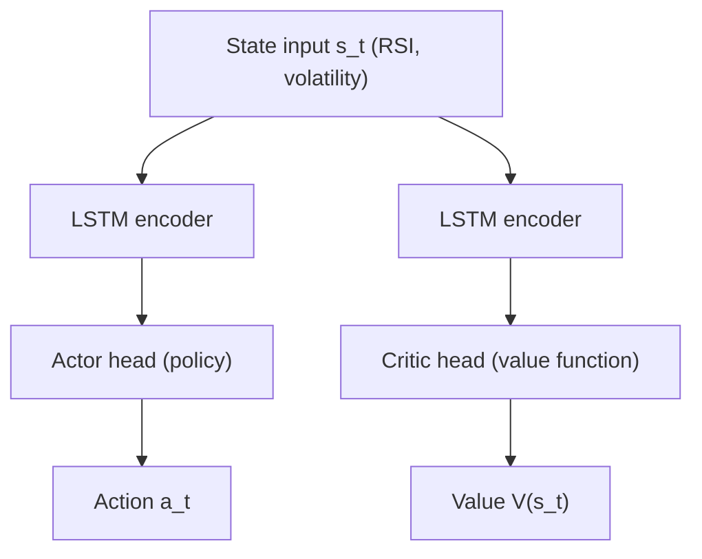

### Project Overview

Financial markets represent a highly challenging domain for classical machine learning due to low signal-to-noise ratios, non-stationarity, and regime-dependent dynamics (e.g., shifts in volatility, macroeconomic conditions, or monetary policy). Reinforcement learning (RL) agents often suffer from policy collapse or severe overfitting when trained on historical data, as standard formulations assume a stationary Markov Decision Process (MDP).

This project developed a deep reinforcement learning framework that uses adaptive policy exploration and dynamic, risk-adjusted reward functions to keep trading performance stable across shifting market regimes. A transaction cost simulator and non-stationary policy regularization are intended to help the agent hold risk-adjusted returns while limiting drawdowns.

---

### Markov Decision Process Formulation

The portfolio trading task is formulated as a discrete-time Markov Decision Process (MDP), defined by the tuple $\mathcal{M} = (\mathcal{S}, \mathcal{A}, \mathcal{P}, \mathcal{R}, \gamma)$, where $\mathcal{S}$ is the state space, $\mathcal{A}$ is the action space, $\mathcal{P}$ is the transition probability distribution, $\mathcal{R}$ is the reward function, and $\gamma \in (0, 1)$ is the temporal discount factor.

#### 1. State Representation $\mathbf{s}_t$

The state vector at time step $t$ encodes both local market features and the current internal portfolio status, so the Markov property holds:

$$\mathbf{s}_t = [\mathbf{p}_t, \mathbf{v}_t, \mathbf{f}_t, \mathbf{w}_{t-1}, c_t]$$

where:

- $\mathbf{p}_t \in \mathbb{R}^D$ represents the normalized closing prices of the $D$ assets.
- $\mathbf{v}_t \in \mathbb{R}^D$ represents the rolling price variances over multiple lookback windows (e.g., 5-day, 20-day, and 60-day).
- $\mathbf{f}_t \in \mathbb{R}^F$ is a set of technical and statistical indicators, including:
  - **Relative Strength Index (RSI)**: Measures momentum over a 14-day window.
  - **Moving Average Convergence Divergence (MACD)**: Captures trend-following signals.
  - **Bollinger Bands**: Represents local volatility boundaries.
  - **Autoregressive coefficients**: Captures local time-series dependencies.
- $\mathbf{w}_{t-1} \in [0, 1]^D$ represents the portfolio allocation weights from the previous step, satisfying $\sum_{i=1}^D w_{t-1, i} \le 1$.
- $c_t \in [0, 1]$ is the normalized liquid cash proportion of the portfolio.

#### 2. Action Space $\mathcal{A}$

To allow the agent to optimize asset allocations smoothly, the action space is defined as a continuous vector $\mathbf{a}_t \in [-1, 1]^D$.

The actor network outputs raw allocation changes, which are processed through a portfolio manager layer:

- Positive values represent buying or increasing exposure to asset $i$.
- Negative values represent selling or reducing exposure.
- Zero represents holding the current position.

The target allocation weights $\mathbf{w}_t$ are obtained by projecting $\mathbf{w}_{t-1} + \mathbf{a}_t$ onto the simplex extended with the cash position, so that $\sum_{i=1}^D w_{t, i} + c_t = 1$ with every component non-negative, which also prevents short-selling.

A plain softmax is the obvious choice here and it is the wrong one, for two reasons worth stating. It forces $\sum_i w_{t,i} = 1$, which drives cash to zero and makes the $c_t$ state variable inert, contradicting the $\le 1$ constraint above. It is also not idempotent, so a null action $\mathbf{a}_t = \mathbf{0}$ would silently rebalance the portfolio instead of holding it, while the action space defines zero as holding. The projection preserves both properties.

#### 3. Risk-Adjusted Reward Function $\mathcal{R}_t$

Optimizing purely for absolute returns leads to volatile policies that take excessive risks. To enforce risk management, we define the reward function based on a localized, rolling Sharpe Ratio combined with transaction cost penalties:

$$\mathcal{R}_t = \frac{\mathbb{E}\left[ R_{p, t} - R_f \right]}{\sigma(R_{p, t})} - \lambda_{\text{cost}} \sum_{i=1}^D |w_{t, i} - w'_{t, i}|$$

where:

- $R_{p, t}$ is the portfolio return at time step $t$.
- $R_f$ is the risk-free rate (assumed constant or fetched dynamically).
- $\sigma(R_{p, t})$ is the standard deviation of portfolio returns calculated over a rolling 30-day window.
- $w'_{t, i}$ represents the adjusted weight of asset $i$ just before time step $t$ due to price movements:

  $$w'_{t, i} = \frac{w_{t-1, i} (1 + R_{i, t})}{1 + R_{p, t}}$$

- $\lambda_{\text{cost}}$ is a penalty coefficient scaling the impact of transaction costs (commission and slippage).

---

### Actor-Critic Architecture & Training Infrastructure

We implemented a custom Actor-Critic model optimized for non-stationary environments, utilizing Proximal Policy Optimization (PPO) as the core optimization algorithm.

#### 1. Temporal Feature Extraction

To process sequential dependencies in financial data, the policy and value networks share a temporal feature extractor:

- **Bi-directional LSTM layer**: Captures short- and medium-term temporal dependencies.
- **Attention layer**: Applies temporal attention over a 30-day lookback window, highlighting historical regime shifts.

#### 2. Regime-Aware Exploration Regularization

In financial markets, high-volatility regimes require the agent to explore safer hedging strategies, while low-volatility regimes permit exploitation of stable trends. We introduced dynamic entropy regularization scaled by market volatility:

$$\mathcal{L}_{\text{entropy}}(\theta) = \beta(v_t) \mathcal{H}\left(\pi_{\theta}(\cdot | \mathbf{s}_t)\right)$$

The dynamic scaling coefficient $\beta(v_t)$ is formulated as:

$$\beta(v_t) = \beta_0 \cdot \left( 1 + \tanh\left( \frac{v_t - \bar{v}}{\sigma_v} \right) \right)$$

where:

- $v_t$ is the current rolling volatility of the market index.
- $\bar{v}$ and $\sigma_v$ are the historical mean and standard deviation of market volatility, respectively.
- $\beta_0$ is the baseline entropy regularization coefficient.
- Under high market stress ($v_t \gg \bar{v}$), $\beta(v_t)$ increases, prompting the agent to maintain high policy entropy $\mathcal{H}$, which delays premature convergence and sustains exploration.

#### 3. Why PPO Rather Than a Value-Based Method

PPO is used as published, with its standard clipped surrogate objective and generalized advantage estimation. The choice is the interesting part rather than the loss function.

Portfolio allocation has a continuous action space (a weight per asset), which rules out the value-based methods that assume a small discrete action set. Among policy-gradient methods, PPO's clipping removes the incentive to move far on any single sample by zeroing the gradient contribution once the probability ratio leaves its band. It is a heuristic and not a true trust region, since multi-epoch PPO can still produce updates whose divergence exceeds the implied bound, but it empirically damps the step size, and that matters more here than in most benchmarks: financial data is non-stationary and its reward signal has a very low signal-to-noise ratio, so an undamped update can move the policy a long way on what turns out to be one lucky quarter.

The cost is that PPO is on-policy and so needs many samples, which is a real constraint when the amount of genuinely independent market history is fixed and small. Every additional epoch over the same decade increases the chance of fitting that decade rather than the process that generated it.

---

### Simulator and Slippage Modeling

Deploying RL models directly from idealized simulations to live markets often fails due to execution slippage and friction. We built a high-fidelity simulator to bridge this gap.

#### 1. Frictional Impact Model

The simulator models transaction friction using a two-tier cost function:

$$\text{Cost}(\Delta w) = \text{Commission} + \text{Slippage}$$

- **Commission**: Fixed at $0.05\%$ of the transaction volume.
- **Slippage**: Modeled as a quadratic function of the trade size relative to the average daily volume (ADV) of the asset:

  $$\text{Slippage}_i = \eta \left( \frac{\Delta V_i}{\text{ADV}_i} \right)^2$$

  where $\Delta V_i$ is the volume traded and $\eta$ is a market impact coefficient.

#### 2. Validation Strategy

To limit overfitting to specific historical regimes, we used the following evaluation pipeline:

- **Walk-Forward Validation**: The model is trained on a rolling window of 3 years, validated on the subsequent 6 months, and tested on the following 6 months, stepping forward iteratively. A single fixed train/test split is close to meaningless here, because a policy fitted to one volatility regime can look excellent until the regime changes.
- **Regime-Specific Stress Testing**: The policy is evaluated separately on high-stress sub-periods inside the evaluation window, since an aggregate Sharpe ratio computed across a mostly-rising market hides exactly the drawdown behaviour the regime-aware term is meant to control.

---

### Why This Page Has No Results Table

> **No backtest results are reported here.** I have not re-run this study against a return series I can publish, and reporting performance metrics for a trading policy without the underlying series and the exact evaluation window is not a claim a reader can check.

This matters more for trading than for most machine learning applications. Three specific failure modes make backtest numbers unusually easy to overstate, and all three are invisible in a summary table:

- **Regime leakage.** Any evaluation window that includes a sustained bull market flatters a long-biased policy, so the choice of window is itself a result and has to be stated with the metrics.
- **Some summary ratios carry no information beyond the rows above them, and some do.** Sharpe is excess return over volatility, so a Sharpe printed beside an annualized return and an annualized volatility is a restatement of those two numbers and confirms nothing on its own; a value equal to their exact quotient also implies $R_f = 0$, which has to be stated rather than inferred. Sortino and Calmar are different: downside deviation and maximum drawdown are path-dependent statistics that cannot be recovered from a mean and a standard deviation, so those two ratios do carry information about the tails, which is exactly why they need the return series published alongside them rather than a summary table.
- **Friction assumptions dominate.** Under the transaction cost model above, small changes to the impact coefficient $\eta$ change the ranking of policies, so a result quoted without its friction parameters is not reproducible.

The engineering content of this project is the environment design: the regime-conditioned state representation, the volatility-scaled entropy term, and the transaction cost model described above. Those are the parts worth reviewing, and they stand independent of any performance figure.
