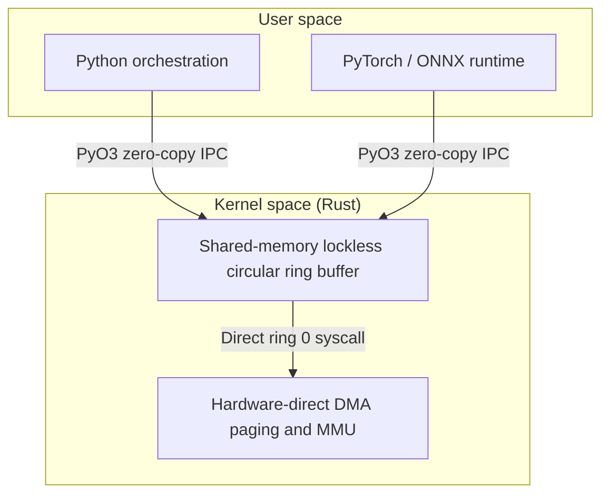

### Project Overview

Modern general-purpose operating systems (such as Linux or Windows) balance interactive desktop responsiveness, generic file system access, and network I/O. Under deep learning workloads, this design adds overhead from frequent CPU-GPU context switches, complex virtual memory hierarchies, and CPU thread schedulers that are blind to tensor pipeline execution states, which leaves the accelerator starved and lowers hardware efficiency.

> **This page is a design study.** AI-Kernel is specified and partially scaffolded, not built. It has never been booted on hardware and there are no measurements. Everything below describes an intended design and the reasoning behind it, in the conditional throughout.

To address this, **AI-Kernel** is specified as a polyglot microkernel operating system. A bare-metal kernel core written in Rust would handle hardware-level safety, while a Python orchestration layer manages tensor compute graph scheduling, with the goal of giving machine learning workloads a dedicated high-throughput, low-latency operating environment.

---

### Proposed Architecture and Microkernel Core

The design places only essential services (such as physical memory allocation, process coordination, and interrupt handling) in supervisor mode (ring 0). All other services, including device drivers and the graph parser, would run in user mode (ring 3).



#### 1. Hardware-Direct DMA Memory Mapping

To bypass virtual memory translation overhead and page-fault latency during massive tensor transfers, the kernel maps virtual pages directly to contiguous physical memory blocks using page-locked Direct Memory Access (DMA):

$$\mathcal{M}_{\text{DMA}}: \mathbf{V}_{\text{addr}} \to \mathbf{P}_{\text{addr}}$$

When a tensor computation graph is initialized, the physical memory allocator reserves a contiguous pool of physical pages. By keeping these pages pinned (preventing the OS from swapping or moving them), the CPU can delegate memory transfers entirely to the GPU's DMA engine. This removes bounce-buffer copies and reduces TLB pressure during active training and inference runs. It does not remove address translation itself, since the MMU still translates every CPU access.

#### 2. Shared-Memory Lockless IPC

Because microkernel components communicate frequently via Inter-Process Communication (IPC), traditional locking mechanisms (such as mutexes) can become system-wide bottlenecks. The design calls for a lockless circular ring buffer in shared memory.

The buffer synchronizes write (producer) and read (consumer) pointers using atomic Compare-And-Swap (CAS) instructions:

$$\text{CAS}(P, V_{\text{expected}}, V_{\text{new}}) = \begin{cases} \text{true} & \text{if } *P = V_{\text{expected}} \text{ (set } *P = V_{\text{new}}\text{)} \\ \text{false} & \text{otherwise} \end{cases}$$

Atomic pointer updates would let user-space drivers and the kernel core exchange control commands without taking a lock, which is the property the design needs; no latency has been measured.

---

### Polyglot Interface & PyO3 Bindings

Rather than implementing complex, rapidly changing deep learning schedulers in compiled low-level Rust, AI-Kernel is structured as a polyglot system. A Python orchestration layer would parse model execution graphs (e.g., ONNX, PyTorch) and manage execution pipelines, while PyO3 bindings link this layer to the Rust kernel.

#### 1. Cross-Language Zero-Copy FFI

Using the **PyO3** framework, the kernel's low-level system interfaces would be exposed to Python as a native module, with the bindings mapping NumPy and PyTorch tensor memory buffers onto the underlying raw C-aligned arrays in Rust without copying:

```rust
#[pyfunction]
fn register_dma_tensor(py: Python, array: &PyArray2<f32>) -> PyResult<u64> {
    let raw_slice = unsafe { array.as_slice()? };
    let physical_address = kernel_map_slice_to_dma(raw_slice.as_ptr(), raw_slice.len());
    Ok(physical_address)
}
```

This layout would let the Python orchestration layer hand multi-gigabyte weight matrices to the low-level PCIe device drivers as a pointer rather than a serialization pass. The hand-off is constant time in the size of the tensor, though registering the region still costs work proportional to it.

#### 2. Threading & GIL Management

To prevent the Python Global Interpreter Lock (GIL) from blocking system-level execution, the PyO3 interface releases the GIL whenever it executes blocking microkernel system calls:

```rust
py.allow_threads(|| {
    // Perform blocking Rust system call to wait for GPU interrupt
    wait_for_gpu_completion(stream_id);
});
```

This lets the Rust-based driver threads respond to hardware interrupts and schedule concurrent operations even while the Python runtime is parsing the next layer of the computation graph.

---

### AI-Native Graph Scheduler Formulation

Unlike standard operating system schedulers (such as Linux's Completely Fair Scheduler) that optimize for fair CPU time sharing, the AI-Kernel scheduler optimizes for tensor pipeline throughput. It maps the execution graph of a neural network to a Directed Acyclic Graph (DAG) $G = (\mathcal{V}, \mathcal{E})$, where $\mathcal{V}$ represents operations (tensor kernels) and $\mathcal{E}$ represents data dependencies.

#### 1. Optimization Formulation

The scheduler prioritizes tasks to maximize the overlapping of host-to-device memory transfers with computation on the accelerator:

$$\text{Throughput} = \frac{\sum_{i=1}^{M} \text{BatchSize}_i}{\sum_{i=1}^{M} \left( T_{\text{transfer}}(i) + T_{\text{compute}}(i) - T_{\text{overlap}}(i) \right)}$$

where:

- $T_{\text{transfer}}(i)$ is the DMA transfer time of model weights and inputs for layer $i$.
- $T_{\text{compute}}(i)$ is the raw execution time of layer $i$ on the GPU.
- $T_{\text{overlap}}(i)$ is the concurrent time window where the DMA engine and the GPU compute cores run in parallel.

#### 2. Double-Buffered Execution Queue

The scheduler maintains two parallel queues:

- **Compute Queue**: Contains tasks ready to execute on the GPU cores.
- **Transfer Queue**: Pre-fetches the weights and activations of subsequent layers into the physical DMA buffers.

By analyzing the DAG structure, the scheduler schedules the transfer of layer $i+1$ inputs during the execution of layer $i$ compute kernels, striving to keep $T_{\text{overlap}}(i) \approx T_{\text{transfer}}(i+1)$ and minimize idle accelerator cycles.

---

### Status and What Remains Unbuilt

Two components are specified in enough detail to implement and are the natural first milestones:

- **Multiboot2 boot path**: a custom bootloader conforming to the Multiboot2 specification, transitioning from 32-bit protected mode to 64-bit long mode.
- **PCIe discovery**: a minimalist bus driver that scans the physical bus, identifies the accelerator, and configures the Base Address Registers (BARs) to enable direct memory mapping.

The claim this design would have to earn is that a scheduler aware of the DAG structure of an inference graph can keep an accelerator busier than a general-purpose scheduler that treats tensor kernels as opaque work. Testing that claim honestly requires measuring accelerator idle fraction and end-to-end throughput separately, since the two are not interchangeable: eliminating idle time bounds the throughput gain by the ratio of utilizations, and any measured gain beyond that bound comes from somewhere else and needs its own explanation.
