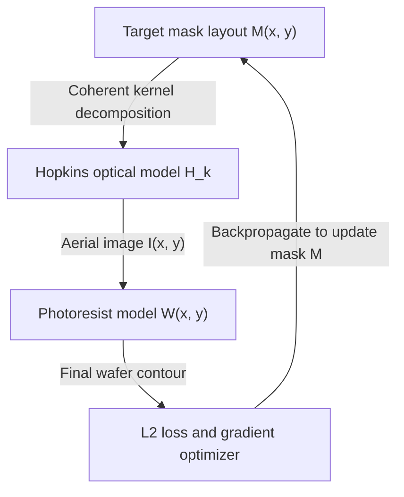
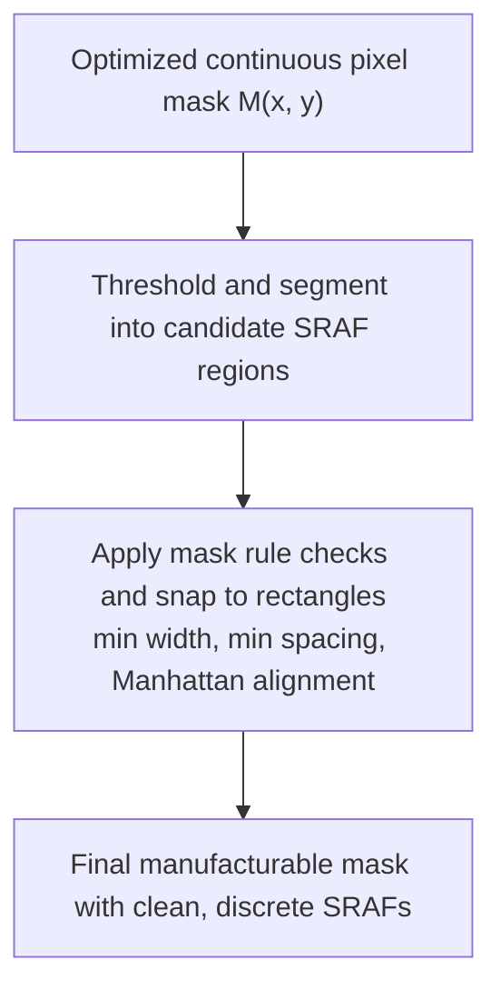

### Project Overview

In advanced semiconductor manufacturing nodes (sub-14nm), the wavelength of light used in deep ultraviolet (DUV) photolithography ($193\text{ nm}$ argon fluoride immersion lasers) is significantly larger than the target feature sizes printed on the silicon wafer. As light passes through the scanner's projection system and photomask, severe diffraction and chemical process distortions occur. These optical distortions lead to structural defects such as line-end shortening, corner rounding, pattern merging, and overall yield loss.

I worked on this at Siemens EDA as part of the Calibre RET and OPC automation effort, owning the model-building and verification automation around the engine. To address these physical limits, the team developed a GPU-accelerated **Inverse Lithography Technology (ILT)** and **Model-Based Optical Proximity Correction (OPC)** engine. The software treats mask synthesis as a mathematical inverse problem. By modeling the forward optical and photoresist physics, the engine optimizes the photomask layout to minimize the discrepancy between the printed wafer contours and the target integrated circuit design.

---

### Forward Lithography Modeling

The forward simulation pipeline models how light propagates through the optical projection system and how the photoresist layer reacts to the incident light intensity.

#### 1. The Hopkins Diffraction Model

We model the light intensity profile at the wafer plane, known as the aerial image $I(x, y)$, using Hopkins' theory of partially coherent imaging. The partially coherent optical system is represented by the transmission cross-coefficient (TCC) matrix. We perform a Singular Value Decomposition (SVD) on the TCC matrix to decompose the partially coherent system into a sum of coherent systems (the Optimal Coherent Approximation, or OCA):

$$I(x, y) = \sum_{k=1}^{N_c} \lambda_k \left| \left( M * H_k \right)(x, y) \right|^2$$

where:

- $M(x, y) \in [0, 1]$ is the continuous mask transmission function ($1$ for clear quartz, $0$ for the opaque absorber).
- $H_k(x, y)$ are the coherent kernels representing the scanner's pupil function, numerical aperture (NA), and illumination source.
- $\lambda_k$ is the eigenvalue associated with the $k$-th coherent kernel, indicating its relative energy contribution.
- $*$ denotes the 2D spatial convolution operation.
- $N_c$ is the truncation order (typically $N_c = 5$ to $10$), balancing simulation accuracy and runtime.

#### 2. The Photoresist Reaction Model

Once the aerial image $I(x, y)$ is computed, we model the chemical response of the photoresist during the exposure and post-exposure bake (PEB) steps. The concentration of photo-acid generators and the subsequent development process are approximated using a continuous, differentiable sigmoid function:

$$W(x, y) = \frac{1}{1 + \exp\left(-\alpha \left(I(x, y) - I_{th}\right)\right)}$$

where:

- $W(x, y) \in [0, 1]$ represents the local resist development probability (where $W \ge 0.5$ designates dissolved resist, representing the final wafer contour).
- $I_{th}$ is the threshold intensity parameter determined by process calibration.
- $\alpha$ is the scaling factor modeling the contrast of the chemical photoresist formulation.

---

### GPU-Accelerated Inverse Lithography Formulation (ILT)

We formulate mask synthesis as a high-dimensional, non-convex optimization problem over the continuous mask pixel grid $M(x, y)$.

#### 1. Objective Function

The goal is to find a mask $M(x, y)$ that minimizes the difference between the simulated wafer contour $W(x, y)$ and the target circuit design $T(x, y)$ while maintaining manufacturability:

$$\mathcal{J}(M) = \iint_{\Omega} \left( W(x, y) - T(x, y) \right)^2 dx\,dy + \gamma_{\text{TV}} \mathcal{R}_{\text{TV}}(M) + \gamma_{\text{tone}} \mathcal{R}_{\text{tone}}(M)$$

where:

- $\mathcal{R}_{\text{TV}}(M)$ is the Total Variation (TV) regularization term, which suppresses high-frequency noise and prevents the optimizer from generating fragmented, unmanufacturable shapes:

  $$\mathcal{R}_{\text{TV}}(M) = \iint_{\Omega} \sqrt{\left(\frac{\partial M}{\partial x}\right)^2 + \left(\frac{\partial M}{\partial y}\right)^2} dx\,dy$$

- $\mathcal{R}_{\text{tone}}(M) = \iint_{\Omega} M^2(1 - M)^2 dx\,dy$ is a tone-consistency penalty that forces the optimized mask pixels to converge to binary values ($0$ or $1$) at the end of the optimization process.
- $\gamma_{\text{TV}}$ and $\gamma_{\text{tone}}$ are weighting hyperparameters.

#### 2. CUDA-Accelerated Gradient Optimization

Because the forward model is composed of differentiable operations (convolutions and element-wise functions), we compute the analytical gradient of the objective function with respect to the mask layout $\nabla_M \mathcal{J}$ using backpropagation.

We implemented the optimization framework in PyTorch with custom CUDA-accelerated convolution kernels. The optimization updates the mask iteratively using a gradient-descent optimizer with momentum (such as Adam):

$$M^{(l+1)} = \text{clip}\left( M^{(l)} - \eta \cdot \text{Adam}\left(\nabla_{M^{(l)}} \mathcal{J}\right), 0, 1 \right)$$

By executing the multi-channel 2D convolutions ($M * H_k$) in parallel on GPU tensor cores, we accelerate the gradient calculation steps.

---

### Sub-Resolution Assist Feature (SRAF) Generation

Sub-Resolution Assist Features (SRAFs) are narrow geometries placed on the mask that do not print on the wafer themselves but help collect diffracted light to improve the depth of focus and process window of the target features.

1. **Continuous SRAF Detection**: The continuous-pixel optimization naturally develops low-intensity, isolated bands around primary features, which act as model-based assist features.
2. **Geometrical Fitting**: The continuous mask representation is segmented into isolated regions. These regions are fitted with rectangular shapes using custom polygon-extraction algorithms.
3. **Mask Rule Check (MRC) Alignment**: The fitted rectangles are snapped to a grid and verified against manufacturing constraints (e.g., minimum SRAF width and minimum spacing between SRAFs and main features), ensuring the mask can be manufactured by standard electron-beam mask writers.

---

### How This Was Evaluated

> **Scope note.** This work was carried out at Siemens EDA on customer layouts and calibrated process models. Edge placement, process window, and runtime figures are internal and are not reported here.

The evaluation used representative sub-14nm logic layouts (dense metal lines and contact hole arrays) because these two cases fail differently and a mask optimizer that handles one can easily degrade the other.

Three metrics are needed together, and any one of them alone is misleading:

- **Edge Placement Error (EPE)** measures how far the printed contour sits from the target at nominal dose and focus. Optimizing EPE alone produces masks that print beautifully at nominal conditions and fail on the wafer.
- **Process variation band area** measures contour spread across the dose and focus corners, capturing what EPE at nominal cannot: whether the solution survives real scanner drift.
- **Mask Error Enhancement Factor (MEEF)** measures how strongly a mask writing error is amplified onto the wafer. An aggressive pixel-level solution can improve both EPE and PV band while pushing MEEF to a value the mask shop cannot manufacture, so MEEF acts as the constraint that keeps the optimization physically realizable.

Runtime was measured on the full optimization loop for a standard layout block, comparing a multi-core CPU baseline against single-GPU and multi-GPU execution. The relevant question for production is not the speedup ratio but whether a full-chip run fits inside a tapeout schedule, which is a threshold rather than a slope.

#### A Note on Mask Representation

The formulation above treats the mask transmission as a real field on $[0, 1]$ constrained toward binary tone, which models an opaque-absorber-on-glass mask. This is a deliberate scope restriction. An attenuated phase-shift mask carries a signed amplitude (a nominal 6% attenuator at 180 degrees has transmission $-\sqrt{0.06}$), and a general mask model is complex-valued. Either case breaks the $[0, 1]$ box constraint, changes the forward imaging model, and changes the shape of the binarization penalty. Attenuated PSM is used on many layers at these nodes, alongside binary approaches such as OMOG combined with SRAFs, so this restriction bounds which layers the engine applies to.
