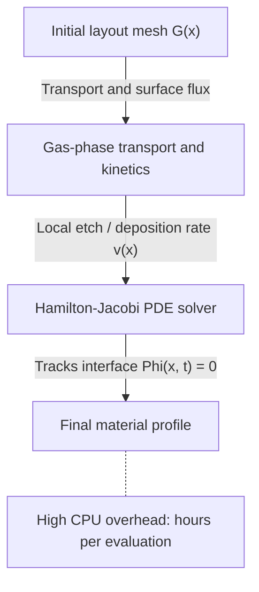
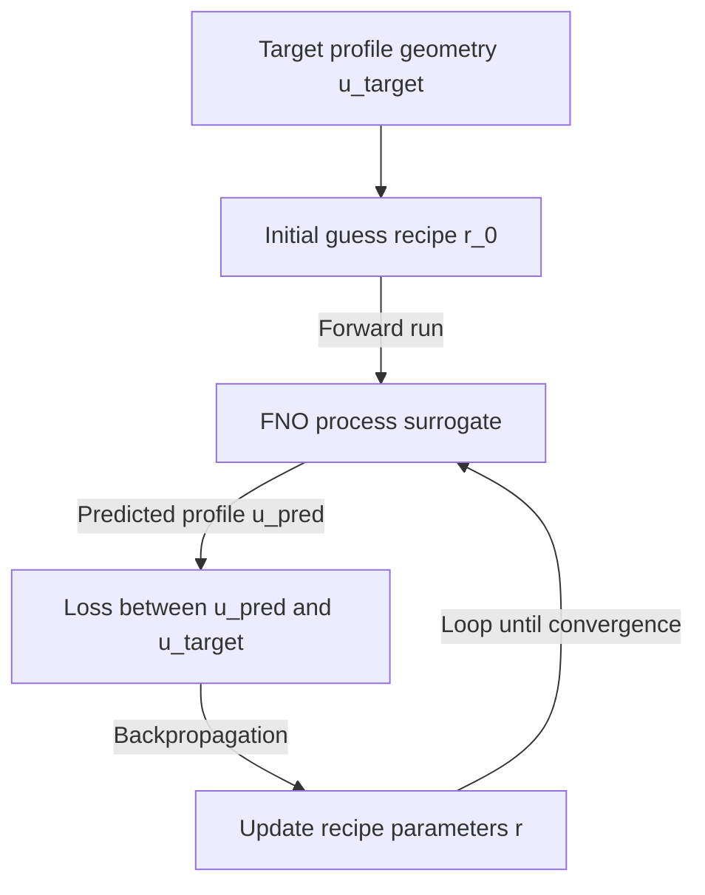

### Project Overview

Technology Computer-Aided Design (TCAD) process simulation is essential for exploring the design space and manufacturing feasibility of advanced semiconductor architectures (such as FinFETs, nanosheets, and backside power delivery systems). However, traditional TCAD tools rely on solving coupled, non-linear Partial Differential Equations (PDEs) representing gas-phase transport, surface reaction kinetics, and level-set interface propagation. These physical simulations take hours to evaluate, creating a bottleneck for Design-Technology Co-Optimization (DTCO) workflows.

I built this surrogate framework at Siemens EDA. To address the computational bottleneck, it is based on **Fourier Neural Operators (FNOs)** and **Physics-Informed Neural Networks (PINNs)**. The framework maps layout geometries and process recipe parameters directly to post-fabrication cross-sectional profiles. By bypassing numerical level-set PDE solvers, the surrogate models accelerate semiconductor process simulation while retaining physical accuracy.

---

### Semiconductor Process Physics & Classical TCAD

Traditional process simulation tracks the physical interface boundary of materials during etch and deposition steps.

#### 1. Level-Set Interface Propagation

In classical TCAD, the interface boundary between materials is represented implicitly as the zero level-set of a higher-dimensional function $\Phi(\mathbf{x}, t) = 0$. The evolution of this boundary is governed by the Hamilton-Jacobi equation:

$$\frac{\partial \Phi(\mathbf{x}, t)}{\partial t} + v(\mathbf{x}, t) \left\| \nabla \Phi(\mathbf{x}, t) \right\| = 0$$

where $v(\mathbf{x}, t)$ is the local velocity (etch or deposition rate) normal to the interface.

#### 2. Local Surface Flux Calculation

The local velocity $v(\mathbf{x}, t)$ depends on the chemical species concentration and local physical flux:

- **Knudsen Diffusion**: Models the transport of neutral gas-phase reactants inside deep trenches.
- **Ion Bombardment**: Models directional ion flux, which is sensitive to local shadowing effects and surface orientation.
- Solving these transport equations at every time step requires dense discretization grids, leading to substantial CPU and memory overhead.

---

### Fourier Neural Operator (FNO) Surrogate Architecture

To accelerate this simulation, we replace the numerical level-set PDE solver with a Fourier Neural Operator (FNO). FNOs learn mappings between infinite-dimensional function spaces by parameterizing integral kernels in the Fourier domain.

#### 1. Mathematical Formulation

Given an input function space representing initial geometries and process parameters, the FNO maps it to the output profile function space. The network consists of multiple Fourier layers:

$$u_{l+1}(\mathbf{x}) = \sigma \left( W u_l(\mathbf{x}) + \mathcal{F}^{-1} \left( R_l \cdot \mathcal{F}(u_l) \right)(\mathbf{x}) \right)$$

where:

- $\mathcal{F}$ and $\mathcal{F}^{-1}$ represent the forward and inverse Fast Fourier Transforms (FFT).
- $R_l$ is a tensor of learnable complex weights that filters out high-frequency spatial components.
- $W$ is a linear projection (residual connection) that maps spatial features.
- $\sigma$ is a non-linear activation function (such as GELU).
- $\mathbf{x}$ represents the spatial coordinate vector.

By operating in the frequency domain, the FNO models global spatial correlations, which allows it to capture shadow-casting and transport effects across wide layout windows.

#### 2. Physics-Informed Constraints (PINN Loss)

To prevent the model from outputting physically impossible structures (such as isolated pockets of air trapped inside solid material or discontinuous boundaries), we introduce physical regularization constraints into the loss function:

$$\mathcal{L} = \mathcal{L}_{\text{data}} + \lambda_{\text{mass}} \mathcal{L}_{\text{mass}} + \lambda_{\text{bc}} \mathcal{L}_{\text{bc}}$$

- **Data-Driven Loss**: The mean squared error relative to ground-truth TCAD datasets:

  $$\mathcal{L}_{\text{data}} = \frac{1}{N} \sum_{i=1}^N \left\| u_{\text{pred}}^{(i)} - u_{\text{tcad}}^{(i)} \right\|^2$$

- **Mass Conservation**: Ensures the volume change matches the total integrated etch or deposition flux over time.
- **Boundary Continuity**: Penalizes high-frequency spatial gradients in the predicted level-set boundary to prevent physical fragmentation.

---

### Closed-Loop Recipe Optimization

By replacing slow TCAD solvers with a fast, differentiable FNO surrogate, we can perform inverse process design: finding the exact process recipe parameters needed to achieve a target profile geometry.

1. **Target Profile Specification**: The user specifies a target post-etch profile, such as a high-aspect-ratio silicon trench with a target sidewall angle:

   $$\theta_{\text{sidewall}} = 90^\circ \pm 0.2^\circ$$

2. **Differentiable Inverse Design**: We define a loss function between the predicted profile $u_{\text{pred}}(\mathbf{r})$ and the target profile $u_{\text{target}}$. Because the FNO is fully differentiable, we compute the analytical gradient with respect to the process recipe parameters $\mathbf{r} = [\text{Gas Flow}, \text{RF Power}, \text{Chamber Pressure}, \text{Etch Time}]$:

   $$\nabla_{\mathbf{r}} \mathcal{J} = \frac{\partial \left\| u_{\text{pred}}(\mathbf{r}) - u_{\text{target}} \right\|^2}{\partial \mathbf{r}}$$

3. **Gradient Descent Optimization**: The optimization loop updates the recipe vector $\mathbf{r}$ iteratively, searching the recipe space directly.

---

### Validation Approach

The accuracy and runtime figures from this work stay inside Siemens, so what follows is how the surrogate was evaluated rather than what it scored. The surrogate was validated against 3D profiles from a numerical process simulator covering high-aspect-ratio reactive ion etching (RIE) and plasma-enhanced chemical vapor deposition (PECVD).

Two categories of error matter for this problem, and reporting only one of them hides the failure mode that actually costs silicon:

- **Structural error** was measured per process step against the numerical solution: sidewall angle and trench bottom width for the etch case, step coverage and void volume for the deposition case. These are the quantities a downstream device model consumes, so a surrogate that matches an aggregate loss while missing sidewall angle is not usable.
- **Contour error** was measured as mean Chamfer distance between surrogate and TCAD contours, which captures shape agreement that per-dimension metrics can miss.

The runtime comparison evaluates a batch of distinct process recipes end to end on the numerical level-set solver (multi-core CPU) against the FNO surrogate (single NVIDIA RTX A6000), since per-call latency understates the gain when a DTCO sweep amortizes model loading across hundreds of evaluations. The design objective was to make process-window exploration interactive rather than overnight, which changes how a DTCO study is run: a sweep that must be queued gets specified once and accepted, while a sweep that returns in seconds gets iterated.
