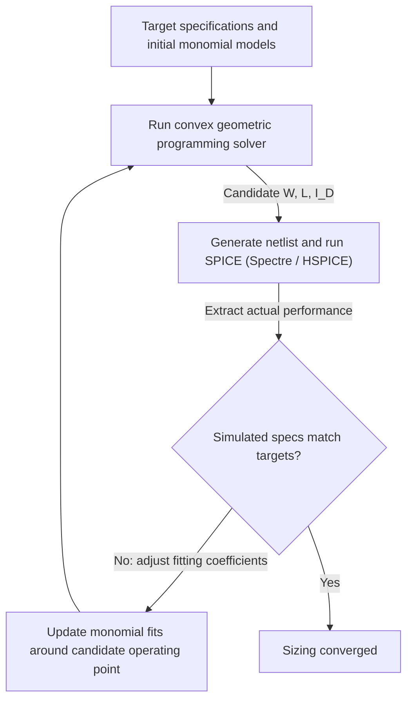

### Project Overview

Analog integrated circuit (IC) sizing is one of the most time-consuming steps in semiconductor design. Choosing transistor channel widths ($W$), lengths ($L$), bias currents, and passive component values means balancing competing performance specifications: low-frequency open-loop gain, unity-gain bandwidth, phase margin, power dissipation, noise, and silicon area. Because transistor behavior in sub-micron regimes is highly non-linear, designers typically rely on manual sizing and iterative SPICE simulations.

This page covers my analog design work from 2012 to 2017, which included modeling and optimizing two-stage Miller OTAs across process variations. What follows is the **Geometric Programming (GP)** formulation of the sizing problem as I would set it up, rather than a description of a shipped tool: the process node, the load capacitance, and the SPICE calibration loop below are the setup this formulation assumes, not measurements from a system I can point you at. By modeling performance metrics as posynomial functions and coupling the optimization with a closed-loop SPICE simulation engine, the framework is designed to size circuit parameters in one solve rather than by manual iteration, with SPICE in the loop to keep the fitted models honest.

---

### Geometric Programming (GP) Formulation

Geometric programming is a class of mathematical optimization problems characterized by objective functions and constraints expressed as posynomials and monomials.

A GP minimizes a posynomial subject to posynomial inequality and monomial equality constraints, over strictly positive variables. Under the change of variables $y_i = \ln x_i$ the whole program becomes convex, which is what buys the global optimum and the infeasibility certificate discussed below. The solver is a standard interior-point method.

The engineering consequence is the constraint this places on the modeling, not the algebra. Every specification has to be written as a posynomial, a sum of terms $c \, x_1^{a_1} \cdots x_n^{a_n}$ with $c > 0$ and arbitrary real exponents. Positive coefficients are the binding restriction: any physical effect that enters with a negative sign has to be rearranged into the constraint's other side or dropped. That is the reason the small-signal parameters below are fitted as monomials rather than taken from a compact model, and it is where the approximation error in this method actually lives.

---

### Performance Characterization for a Two-Stage Miller OTA

To apply GP to an operational transconductance amplifier (OTA), we express its small-signal parameters and design constraints in terms of transistor dimensions.

The topology is the standard two-stage Miller-compensated OTA:

- **First stage**: an NMOS differential pair $M_1/M_2$ driven by the inputs, loaded by a PMOS current mirror $M_3/M_4$, biased by a tail current source $M_5$.
- **Second stage**: a common-source amplifier $M_6$ with an active load $M_7$, driving the output node.
- **Compensation**: a Miller capacitor $C_c$ bridging the first-stage output and the second-stage output, which splits the two poles and sets the unity-gain bandwidth at $g_{m1}/C_c$.

The sizing variables are the widths and lengths of $M_1$ through $M_7$, the tail current, and $C_c$.

#### 1. Small-Signal Transistor Monomial Fits

In sub-micron processes, classical square-law models ($I_D \propto W/L (V_{gs}-V_{th})^2$) do not capture short-channel effects like velocity saturation. We model small-signal characteristics ($g_m$, $g_{ds}$, and capacitances $C_{gg}, C_{gd}$) as monomial functions fitted over SPICE look-up tables:

$$g_{m} \approx \chi \cdot I_D^a \cdot W^b \cdot L^c$$

$$g_{ds} \approx \zeta \cdot I_D^d \cdot W^e \cdot L^f$$

where $\chi, \zeta$ and the exponents $a, b, c, d, e, f$ are fitting parameters optimized for specific bias regions.

#### 2. Sizing Constraints Formulation

Using these monomial fits, we formulate the amplifier specifications:

- **Open-Loop Gain ($A_v$)**:

  $$A_v \approx \left(\frac{g_{m2}}{g_{ds2} + g_{ds4}}\right) \left(\frac{g_{m6}}{g_{ds6} + g_{ds7}}\right)$$

  We express the constraint $A_v \ge A_{\text{target}}$ as a posynomial inequality:

  $$\frac{g_{ds2} + g_{ds4}}{g_{m2}} \cdot \frac{g_{ds6} + g_{ds7}}{g_{m6}} \le \frac{1}{A_{\text{target}}}$$

- **Unity-Gain Bandwidth ($GBW$)**:

  $$GBW = \frac{g_{m1}}{C_c} \ge GBW_{\text{target}} \implies \frac{GBW_{\text{target}} \cdot C_c}{g_{m1}} \le 1$$

- **Phase Margin ($PM$)**:
  To ensure stability, the non-dominant pole $p_2 \approx \frac{g_{m6}}{C_L}$ is constrained relative to the unity-gain frequency:

  $$p_2 \ge \eta \cdot GBW \implies \frac{\eta \cdot g_{m1} \cdot C_L}{g_{m6} \cdot C_c} \le 1$$

  where $\eta \approx 3.0$ is the usual rule of thumb for a $60^\circ$ target.

  This constraint alone does not enforce that target. Miller compensation also creates a right-half-plane zero at $z \approx g_{m6}/C_c$, which subtracts phase without adding roll-off and is the dominant degrader in this topology. With $p_2 = 3\omega_u$ the pole contribution leaves roughly $72^\circ$, and the zero removes $\arctan(\omega_u/z)$ on top of that, so the achieved margin depends on $C_L/C_c$ and falls below $60^\circ$ as $C_c$ approaches $C_L$. A complete formulation adds a constraint on $z$, or a nulling resistor in series with $C_c$ to push the zero out.

---

### Closed-Loop SPICE Verification & Calibration

Because local monomial fits can deviate from actual behavior across wide sizing ranges, we wrap the GP solver in an automated calibration loop with the SPICE simulator.

1. **GP Execution**: The optimization engine solves the convex GP problem using the current monomial model coefficients.
2. **Netlist Generation & SPICE Simulation**: The candidate sizing variables ($W_i, L_i, I_{D,i}$) are written to a SPICE netlist template. The system runs multi-corner AC and transient simulations using Spectre or HSPICE.
3. **Mismatch Extraction & Model Calibration**: The framework compares the simulated performance metrics against the GP model predictions. If the errors exceed the fitting tolerance, it updates the local fitting coefficients ($\chi, \zeta, a, b, \dots$) around the candidate sizing point using a local Jacobian matrix, and re-runs the GP solver. Convergence of this outer loop is not guaranteed by the GP itself, since only the inner problem is convex, and no iteration count is reported here.

---

### How the Formulation Is Evaluated

> **Scope note.** No measured comparison against a manual design is reported here. A speedup claim against "an experienced engineer" is not a reproducible baseline, since the result depends entirely on which engineer, which specification, and how many iterations they were given.

The target problem is sizing a two-stage Miller-compensated OTA in a $65\text{ nm}$ CMOS process for a load capacitance $C_L = 5\text{ pF}$, against specifications on open-loop gain, unity-gain bandwidth, and phase margin, minimizing power dissipation and silicon area.

The reason geometric programming is the right tool here is not that it is faster than a person. A GP transforms to a convex program, so any local optimum it finds is global (the optimizer need not be unique, since the objective is convex rather than strictly convex), and infeasibility comes with a certificate. When the solver reports that no sizing satisfies the constraints, that is a proof for a strictly infeasible instance rather than a failure to search hard enough, which is information a manual iteration loop cannot produce.

The caveat applies to both halves of that guarantee, not just the optimum. Every constraint has to be expressible in posynomial form, so the transistor models are fitted approximations, and the certificate proves infeasibility of the fitted model rather than of the specification itself. A specification the solver declares infeasible may still be reachable by a device behaviour the posynomial fit does not capture.

#### Robust Multi-Corner Sizing

To ensure manufacturing yield, the GP formulation incorporated multi-corner design constraints:

- **Process Corners**: Evaluated across Slow-Slow (SS), Fast-Fast (FF), and Typical-Typical (TT) transistor corners.
- **Temperature Extremes**: Constrained to meet specifications from $-40^\circ\text{C}$ to $125^\circ\text{C}$.
- **Supply Voltage Corners**: Evaluated under $V_{DD} \pm 10\%$.
- Corner constraints enter the program directly rather than being checked afterwards, so a returned solution is feasible across the specified corners by construction. This is the formulation's guarantee, not a measured outcome, and no verified sizing result is reported on this page.
